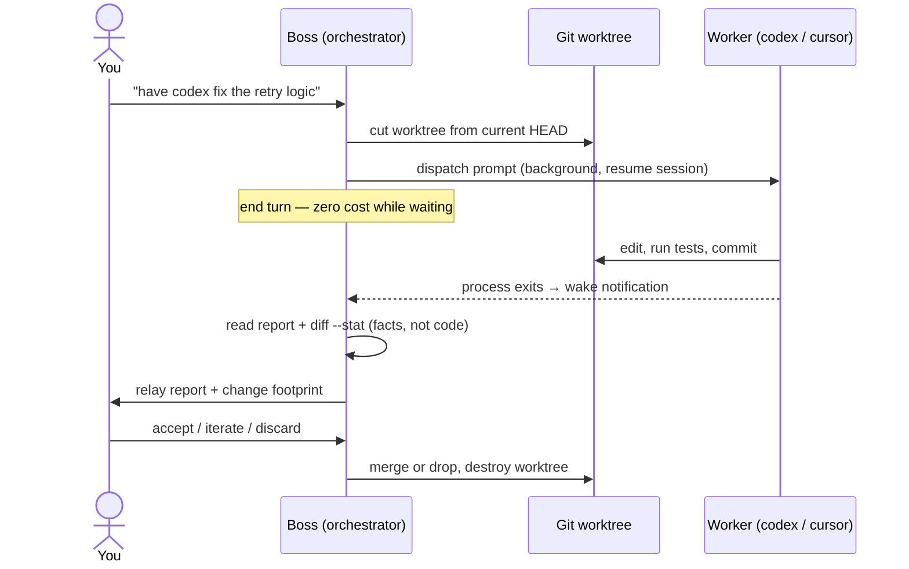
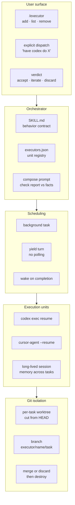

# fable-the-boss

Your agent as the boss. Codex and Cursor as the crew.

An agent skill that turns your coding agent into a task orchestrator which dispatches
work to other coding harnesses — OpenAI Codex CLI, Cursor Agent — running as true
background processes. The boss assigns work, goes idle at zero cost, gets woken up
when a worker finishes, reads the report, and rules: accept, iterate, or discard.

The name is a nod to Claude Fable 5, the model that bossed the first crew around —
and the recommended boss. Orchestration is mostly decision-making in underdetermined
spaces (vague reports, partial evidence, judgment calls with no spec), which is
exactly what Fable 5 is unusually good at. The skill itself is model-agnostic — any
agent whose harness can run a background task and wake on its completion can be the
boss, and workers can be anything with a resumable headless CLI.

## Why

Different harnesses have different strengths, different models, and separate usage
quotas. This skill lets one agent session use them all as execution units while
keeping a single point of judgment, and burning no tokens while they work:

- **The boss orchestrates** — composes self-contained task prompts, reviews reports,
  merges or discards results, escalates real decisions to you.
- **Workers execute** — each is a long-lived session of an external harness
  (`codex exec resume`, `cursor-agent --resume`) that keeps its memory across tasks.
- **True background execution** — dispatch uses the harness's background task
  mechanism; the boss ends its turn after dispatching and is woken by a task
  notification when the worker's process exits. No polling, no blocked turns.

## How it works

One task, end to end:



The exposure surfaces, layer by layer:



## Design

Three principles, each of which fell out of a real failure of the naive design:

1. **Session and workspace are decoupled.** A worker's session (its memory) is
   long-lived. Its workspace is a disposable git worktree created per task from the
   boss's current HEAD, and destroyed once the result is merged or discarded. Work is
   always based on the latest codebase by construction — there is no sync step to
   forget.

2. **The boss stays at the reporting surface.** On wake it reads the worker's final
   report, the exit code, and `git diff --stat` — not the code. The worker's own
   verification (tests, builds) backs quality; the boss does fact-checking (does the
   report match the observable footprint?), and code review happens only when you ask
   for it.

3. **Isolation by worktree, not by OS sandbox.** Workers run with full access
   (`--dangerously-bypass-approvals-and-sandbox` / `--sandbox disabled`) because OS
   sandboxes break legitimate work — spawning browsers for test runners, process
   control, network — while the disposable worktree already confines the blast
   radius. Your main working tree is never touched.

Workers can also stop mid-task and ask for advice (`NEED_ADVICE:` protocol). The boss
answers what it can and escalates to you only what is genuinely yours to decide:
scope trade-offs, irreversible choices.

## Prior art

Anthropic's developer team [shared the two multi-agent patterns they use internally
with Fable 5](https://x.com/ClaudeDevs/status/2074606058128224365): **orchestrator**
(top-down — Fable 5 plans and delegates to cheaper workers; 96% of Fable-solo
performance at 46% of the cost on BrowseComp) and **advisor** (bottom-up — an
executor consults Fable 5 only at decision points; ~92% of Fable's SWE-bench Pro
score at ~63% of the price, with roughly one consult per task).

This skill is a cross-harness reconstruction of both patterns at once:

- **Orchestrator** → the boss plans and dispatches; workers are external harnesses
  instead of cheaper Claude models. The economics are more aggressive than the
  original: worker tokens are billed to each harness's own subscription, and the
  boss costs exactly zero while waiting.
- **Advisor** → the `NEED_ADVICE:` protocol. The official advisor is an inline tool
  call; headless worker CLIs cannot call back mid-run, so this skill uses the
  turn-boundary equivalent — stop and report, boss answers, resume the session.

And where the official patterns require Claude models on both sides (the advisor
tool is beta, with model-pair constraints), this skill only asks that the boss's
harness can wake on background-task completion — the crew can come from any vendor.

## Install

Via [skills.sh](https://skills.sh) (installs into Claude Code, Codex, and other
Agent-Skills-standard harnesses):

```bash
npx skills@latest add tuoxiansp/fable-the-boss
```

Or manually:

```bash
git clone https://github.com/tuoxiansp/fable-the-boss ~/fable-the-boss
ln -s ~/fable-the-boss/skills/executor ~/.claude/skills/executor
```

You also need at least one worker harness:

- [Codex CLI](https://developers.openai.com/codex/cli) — `brew install codex`, then `codex login`
- [Cursor Agent](https://cursor.com/cli) — `curl https://cursor.com/install -fsS | bash`, then `cursor-agent login`

## Is your harness boss material?

The boss side needs exactly one capability: start a process in the background, end
the turn, and get woken when the process exits. Paste this probe into your agent to
find out (it is the exact prompt that bootstrapped this project):

```
This is a harness capability test. Follow these steps EXACTLY. Do not improvise.

1. Print the current time with `date +%T`.
2. Start this command as a TRUE BACKGROUND task (do NOT run it as a normal
   blocking/foreground tool call):
   sh -c 'sleep 180; date +%T > /tmp/harness-wake-test.txt; echo WAKE_SENTINEL'
   If your environment has a dedicated way to run a command in the background
   (a background flag, a task/job tool, etc.), use it. If you have NO way to
   run a command without blocking on it, say exactly "NO_BACKGROUND_SUPPORT"
   and stop.
3. After starting it, END YOUR TURN IMMEDIATELY. Your last message must be
   exactly: "STARTED_AND_YIELDING".
   - Do NOT wait for the command.
   - Do NOT sleep, poll, re-check, or read the output file.
   - Do NOT call any more tools this turn.
4. ONLY IF something wakes you up later (a notification, an injected message,
   a tool event), reply with:
   - the word "WOKEN_BY_HARNESS"
   - the current time from `date +%T`
   - the raw content of whatever woke you, quoted verbatim
   - the content of /tmp/harness-wake-test.txt

Never simulate step 4. If nothing ever wakes you, stay silent forever.
```

If you get `STARTED_AND_YIELDING`, then ~3 minutes of silence, then
`WOKEN_BY_HARNESS` with a timestamp ~180s after the first one — your harness can be
the boss. If the agent blocks on the command, answers immediately, or never comes
back, it can still be a fine *worker*, just not the boss.

## Use

Register execution units (per project; config lives in `.claude/executors.json`):

```
/executor add codex
/executor add cursor --model gpt-5.2
/executor add codex --session <existing-session-id> --name reviewer
/executor list
```

Dispatch explicitly, in natural language:

> have codex implement the retry logic in src/net/, run the tests, and commit

The boss cuts a worktree, dispatches in the background, and yields. When the worker
finishes you get the report and rule on it: accept (merge), iterate (same session,
corrective feedback), or discard. Either way the worktree is destroyed.

The boss may also create new units on its own when the work calls for a parallel
lane — creating units is free, dispatching still requires your word.

## License

MIT
