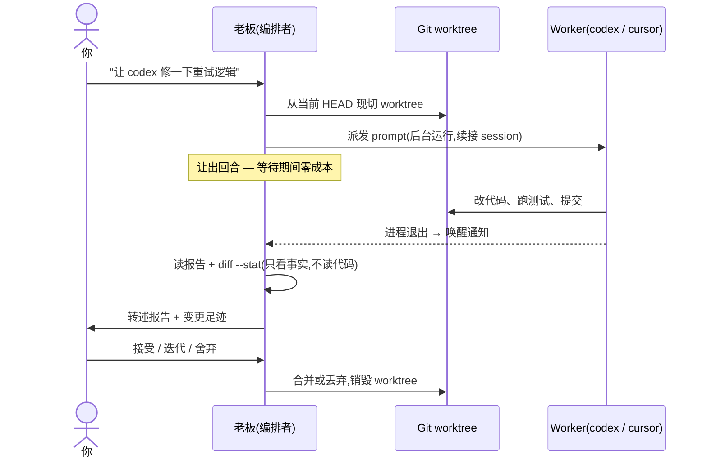

[English](README.md) | 简体中文

# fable-the-boss

你的 agent 当老板;Codex、Cursor 以及任何 headless 编码 agent 当施工队。

## 模式出处:Anthropic 官方

Anthropic 开发者团队[分享过他们内部使用 Claude Fable 5
的多智能体模式](https://x.com/ClaudeDevs/status/2074606058128224365)。本 skill
构建于其中的 **orchestrator(编排者)** 模式:Fable 5 负责规划和委派,便宜的
worker 负责干活,绝大部分 token 按 worker 费率计费——在 BrowseComp 上达到
Fable 单干 96% 的表现,只花 46% 的成本。


<sub>图片来自 Anthropic 的 @ClaudeDevs 线程。</sub>

这套经济账成立的原因:编排工作的本质是在欠定空间里做决策——含糊的汇报、不完整的
证据、没有 spec 的裁量——这恰好是 Fable 5 格外擅长的,也恰好是占大头的便宜 token
所不需要的能力。

## 本 skill:orchestrator 模式的跨 harness 实现

fable-the-boss 把 **orchestrator** 模式还原成一个 agent skill——施工队不再是
便宜的 Claude 模型,而是*其他厂商的 harness*。老板(你的 agent)把任务组装成
自包含的 prompt,派发给其他 harness 的长期 worker session——OpenAI Codex CLI
和 Cursor Agent 作为内置参考实现(`codex exec resume`、`cursor-agent --resume`),
任何拥有可续接 headless CLI 的 harness 都能加入施工队——以真后台进程运行。
经济性比官方原版更激进:worker 的 token 记在各家 harness 自己的订阅上,
老板在等待期间消耗严格为零。

委派不是发完就不管:worker 可以中途停下,报告自己需要什么建议(`NEED_ADVICE:`
协议);老板作答——只把真正属于你的决策上抛给你——然后续推同一个 session。

官方模式要求两端都是 Claude 模型;本 skill 只要求老板的 harness 能在后台任务
完成时被唤醒——施工队可以来自任何厂商,你还能把各家互相独立的配额花在同一处。

## 工作原理

一个任务的完整生命周期:



三条设计原则:

1. **session 与工作区解耦。** worker 的 session(它的记忆)是长期的;它的工作区
   是一次性的——每个任务从老板当前 HEAD 现切一个 git worktree,结果被合并或舍弃
   后即销毁。工作永远基于最新代码,这由构造保证——不存在会被遗忘的同步步骤。

2. **老板停留在汇报面。** 唤醒后它读 worker 的最终报告、退出码和
   `git diff --stat`——不读代码。质量由 worker 自己的验证(测试、构建)背书;
   老板做事实核对(报告与可观察的足迹是否相符),代码评审只在你开口时发生。

3. **隔离靠 worktree,不靠 OS 沙箱。** worker 以完全权限运行
   (`--dangerously-bypass-approvals-and-sandbox` / `--sandbox disabled`),因为
   OS 沙箱会误伤正当工作——为测试起浏览器、进程控制、网络访问——而一次性
   worktree 本来就限定了破坏半径。你的主工作区永远不被触碰。

## 安装

通过 [skills.sh](https://skills.sh)(自动安装进 Claude Code、Codex 等符合
Agent-Skills 标准的 harness):

```bash
npx skills@latest add tuoxiansp/fable-the-boss
```

或者让你的 agent 替你安装——把这段粘给它:

```
Install the "crew" agent skill from https://github.com/tuoxiansp/fable-the-boss
(it lives at skills/crew in that repo).
```

## 使用

`/crew` 接受自由格式的自然语言。先组建施工队(按项目注册;注册表在
`.claude/crews.json`):

```
/crew 把 codex 拉进施工队
/crew 注册 cursor 当 worker,用 gpt-5.2
/crew 把我现有的 codex session abc123 注册为 reviewer
/crew 现在队里都有谁?
```

首次注册时,老板会和你对齐一次模型基线——每个 harness 用什么模型、什么活适合
它——存进注册表的 `$policy` 键,之后的决策不再重复问。

然后正常干活就行。**老板会凭自己的判断委派**:给它目标,它自己决定什么交给
施工队、什么亲自做,每次派发用一行话向你报备。需要并行泳道时它也会(按
`$policy` 基线)自行增设新 worker。你随时可以显式指挥:

```
/crew 让 codex 实现 src/net/ 里的重试逻辑,跑完测试并提交
```

——或者在对话里否决某次委派("这个你自己做")。

每个被派发的任务,老板都会现切一个 worktree、后台派发、然后让出回合。worker
完成后你会收到报告并裁决:接受(合并)、迭代(同一 session 继续,附纠正反馈)、
或舍弃。无论哪种,worktree 都会被销毁。

> [!TIP]
> 老板驱动 worker session 期间,该 harness 自己的界面可能看不到实时更新:
> headless 回合通常只开场说一句话,然后就静默地跑工具调用,同一 session 上开着
> 的 app 或 TUI 会显得"卡住了",实际上 worker 正干得起劲。请通过老板的汇报
> (或 tail 派发任务的输出流)跟进进度——并且不要从两个入口同时驱动同一个
> session:session 历史是单写者假设。

## 你的 harness 有老板命吗?

当老板只需要一种能力:后台启动进程、结束回合、进程退出时被唤醒。把这段探针
粘给你的 agent 试试(这正是引导本项目诞生的那个 prompt,原文保留):

```
This is a harness capability test. Follow these steps EXACTLY. Do not improvise.

1. Print the current time with `date +%T`.
2. Start this command as a TRUE BACKGROUND task (do NOT run it as a normal
   blocking/foreground tool call):
   sh -c 'sleep 180; date +%T > /tmp/harness-wake-test.txt; echo WAKE_SENTINEL'
   If your environment has a dedicated way to run a command in the background
   (a background flag, a task/job tool, etc.), use it. If you have NO way to
   run a command without blocking on it, say exactly "NO_BACKGROUND_SUPPORT"
   and stop.
3. After starting it, END YOUR TURN IMMEDIATELY. Your last message must be
   exactly: "STARTED_AND_YIELDING".
   - Do NOT wait for the command.
   - Do NOT sleep, poll, re-check, or read the output file.
   - Do NOT call any more tools this turn.
4. ONLY IF something wakes you up later (a notification, an injected message,
   a tool event), reply with:
   - the word "WOKEN_BY_HARNESS"
   - the current time from `date +%T`
   - the raw content of whatever woke you, quoted verbatim
   - the content of /tmp/harness-wake-test.txt

Never simulate step 4. If nothing ever wakes you, stay silent forever.
```

如果你先看到 `STARTED_AND_YIELDING`,然后约 3 分钟的沉默,接着收到带时间戳
(比第一次晚约 180 秒)的 `WOKEN_BY_HARNESS`——你的 harness 可以当老板。如果
agent 阻塞在命令上、立刻回答、或再也没回来,它仍然可以当个好 *worker*,只是
当不了老板。

## 名字的由来

致敬 Claude Fable 5——本 skill 所还原的 orchestrator 模式属于它,它也是第一个
带这支施工队的模型,以及我们推荐的老板人选。skill 本身与模型无关。

## 许可证

MIT
